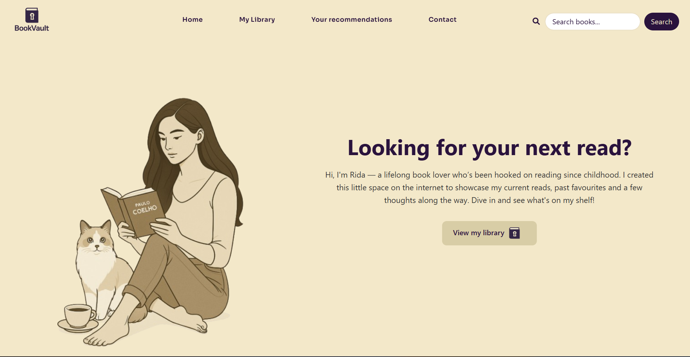
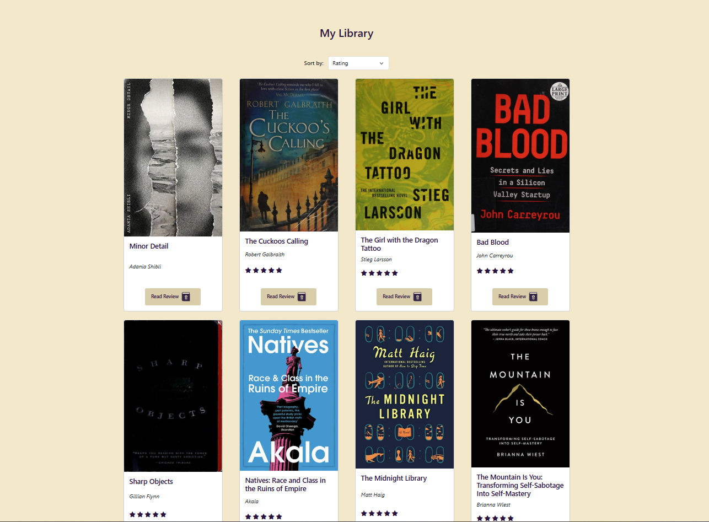
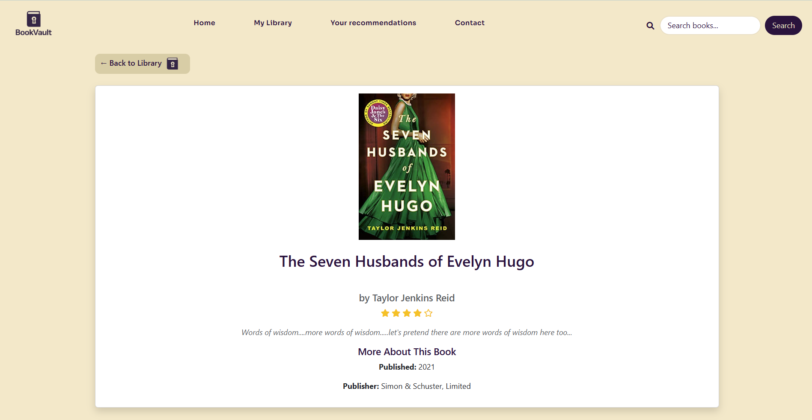
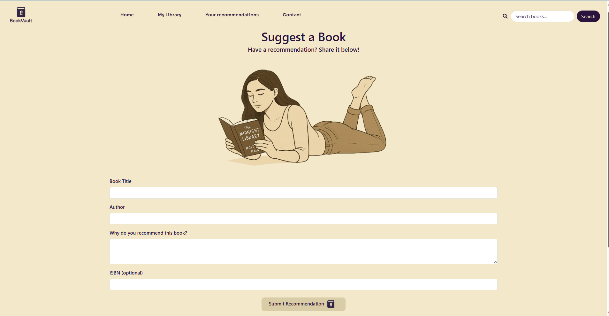

# 📚 BookVault

**BookVault** is a personal book database website built using Node.js, Express, EJS, and PostgreSQL. It integrates with the Open Library API to display book covers and detailed metadata, offering a smooth and visually appealing way to organise, rate, review and recommend books.

## 📌 Features

**📖 Book Library Display** → Users can view a curated collection of books with titles, authors, ratings and cover images.

**⭐ Star Ratings & Reading Status** → Each book entry includes a 5-star visual rating system and reading status (e.g. "currently reading").

**🔍 Search with Live Suggestions** → A dynamic search bar offers dropdown suggestions with book titles, authors and cover images.

**🆕 Book Recommendation Form** → Users can recommend a book by filling out a simple form with title, author, reason and optional ISBN.

**📚 Sort by Menu** → Users can sort books by rating, recency or currently reading status using a clean dropdown interface.

**📦 Error Handling** → Fallback cover images appear if no ISBN match is found and server/API errors are logged appropriately.

---

## 🛠 Tech Stack

**Frontend**: HTML, CSS, Bootstrap 5, JavaScript  
**Templating**: EJS  
**Backend**: Node.js, Express.js  
**Database**: PostgreSQL  
**API Integration**: Open Library Covers API & Books API  
**Hosting**: Render  
**Package Tools**: Axios, dotenv, pg, body-parser

---

## 🔗 Open Library API Usage

- Displays book covers using ISBN with the Open Library Covers API
- Fetches detailed metadata (publish date, number of pages, publishers) for individual reviews using the Books API
- Axios is used server-side to perform GET requests and handle response data

---

## 📌 Project Objectives

This project was created as part of my full-stack development training to demonstrate:

- ✅ Practical integration of public APIs into web projects
- ✅ Backend development with Express/Node.js
- ✅ Dynamic rendering of data using EJS templating
- ✅ CRUD operations (Create, Read, Update, Delete) using PostgreSQL
- ✅ Sorting, filtering and presenting data in a user-friendly format
- ✅ Effective use of Axios for server-side HTTP requests
- ✅ To ensure error handling is in place for both the application and any API requests

## 🚀 Live Website

🔗 [https://bookvault-15pk.onrender.com](https://bookvault-15pk.onrender.com)

## 📜 License

This project was built for educational purposes as part of the App Brewery Full-Stack Web Development course by Dr. Angela Yu on Udemy. Some visual assets are sourced from Open Library and are used with attribution.

---

## 👩🏽‍💻 Author

Developed by Rida Siddique 

[GitHub](https://github.com/rsiddique98) | [LinkedIn](https://www.linkedin.com/in/rida-siddique-670098108/)

---
